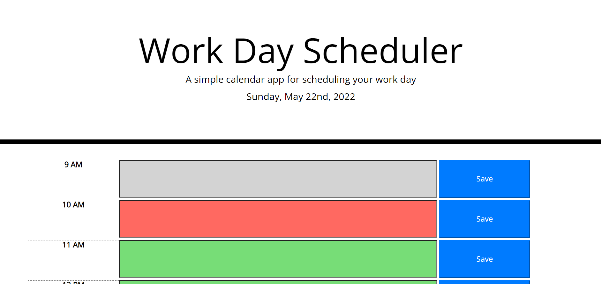
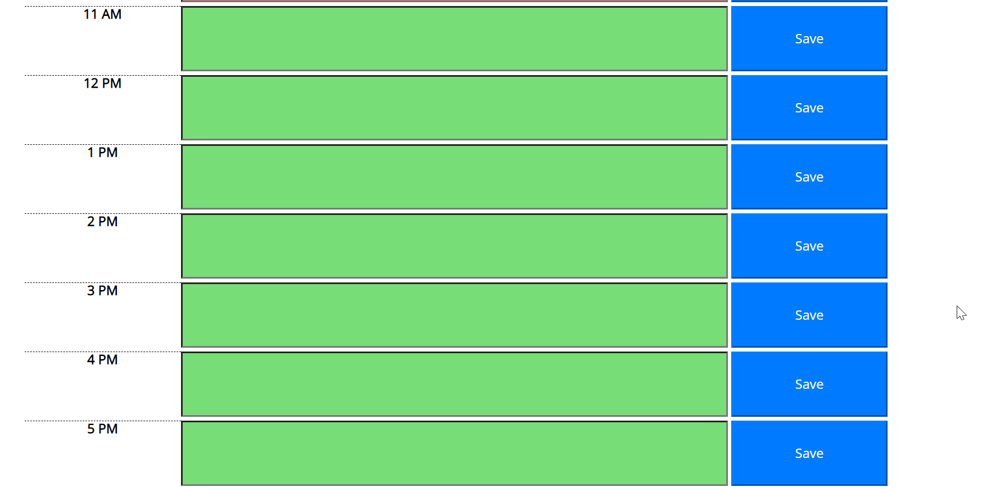

# workday-scheduler-collier

# Description

This application is designed to present the user with an editable schedule listed by hour. When the page loads, the current date is displayed at the top of the screen.

When the page loads it dynamically generates the hour blocks, then determines if they are in the past, present, or future. Once that is done, the application checks local storage for any events and populates the time slots with that information.

One of the improvements that I could make to this application is to have the date of the previously entered events stored as well so that local storage can be cleared if the date is changed.

Then if the user enters an event into a timeslot and clicks the save button, the text for that event is saved to local storage so that it can be reloaded the next time the page is loaded.

Below are screenshots of the application.

Link: https://robsquaadd.github.io/workday-scheduler-collier/
